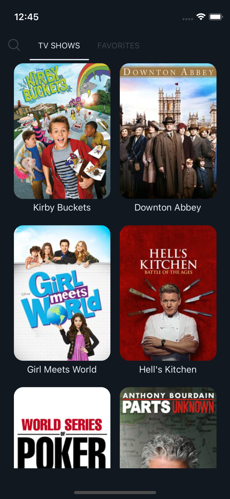
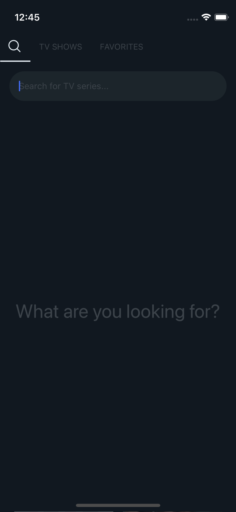
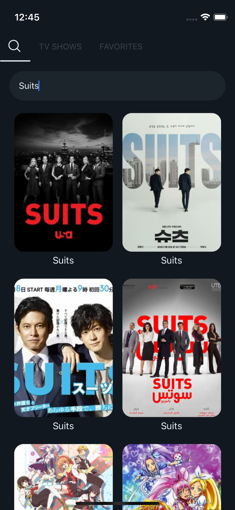
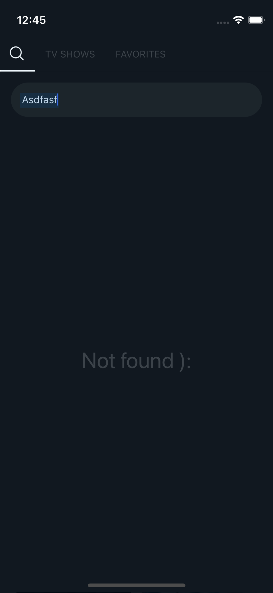
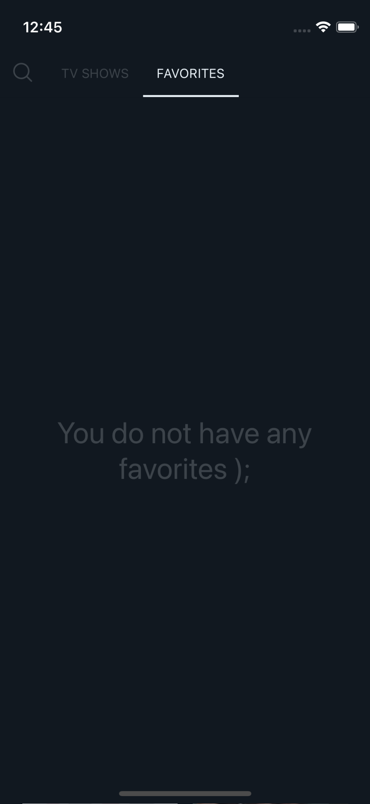
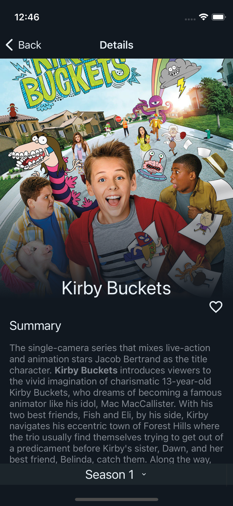
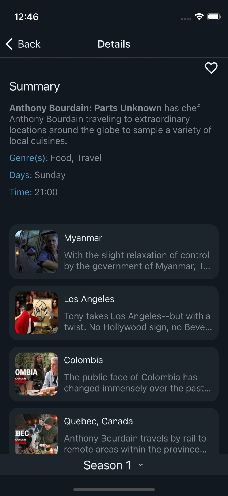
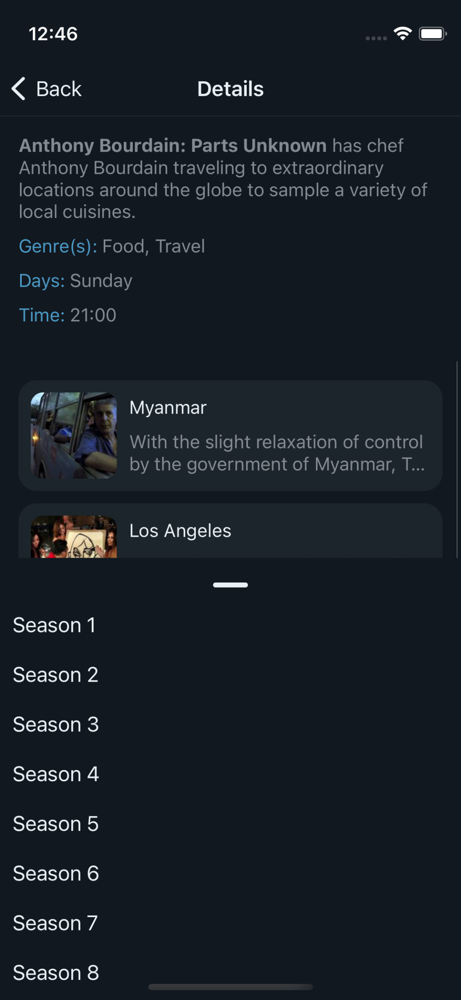
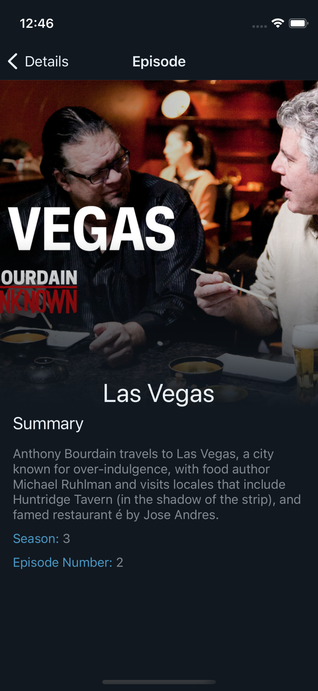

# TV Shows

<p float="left">
  
  
  
  
  
  
  
  
  
  
</p>

## Important

This project was made using [Expo](https://docs.expo.dev/) for [React Native](https://reactnative.dev/) (Note: I work professionally with react-native-cli).

To run this project you need to have a node environment (version >= 14) and [Expo](https://docs.expo.dev/) installed.

## Run Project

To run the project, execute the following commands:

```
yarn install

```

```
yarn android
```

OR

```
yarn ios
```

## Done Tasks

### Required Tasks

All the required tasks are completed.

### Optional Tasks

- Allow the user to save a series as a favorite.
- Allow the user to delete a series from the favorites list.
- Allow the user to browse their favorite series in alphabetical order, and click on one to see its details.

## APK for testing

A universal apk was generated using the following command:

```
expo build:android -t apk
```

It is in the [distribution folder](./distribution/) (: